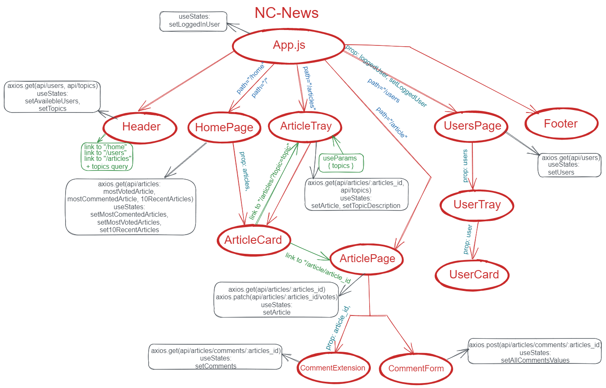

# NC-NEWS

Welcome to NC-NEWS, a news aggregation and discussion platform.

You can access the hosted version of this project at [nc-news-vy.netlify.app](https://nc-news-vy.netlify.app/). Please note that it may take some time for all the articles to upload.

NC-NEWS is a front-end project developed as part of my studies at the Northcoders bootcamp. The project showcases my skills in frontend development using the React framework. NC-NEWS is built using React Native.

The project is based on the backend server that was also created as part of the Northcoders bootcamp. You can find the backend server repository here: [GitHub Repository](https://github.com/valeriorichi/NC-NEWS-SERVER-API) or access the hosted backend version here: [Hosted Backend](https://val-northcoders.onrender.com/api)

  

## Installation and Setup Instructions

To create a local copy of this repository, you will need to fork the repo on GitHub, copy the HTTPS URL, and then use the following command in your terminal:

`git clone https://github.com/valeriorichi/NC-NEWS.git`

Once in the repo, navigate to the project directory and run the following command to install all the necessary dependencies:

`npm install`

To start the server, use the following command:

`npm start`

Make sure you have Node.js (version 18.15.0 LTS or higher) and npm installed globally on your machine.

## Using the Site

On loading of the page, you will receive a list of usernames which can then be chosen to login with. After logging you can view a list of topics which lead to a list of articles for the given topic. When viewing an article's page, you may want to read its comments or add one of your own! This is easily done in the add comment section. Voting is available on both articles and comments.

## Built with

- [Create React App](https://create-react-app.dev/) - To bootstrap the app and streamline the creation process.
- [Axios](https://axios-http.com/) - Sends requests to the backend API.
- [React Router](https://reactrouter.com/en/main) - Routing system used throughout the site.

## Agile Development

Agile inspired development practices continue to fuel the development of this project. You can view the online Kanban board for this project [here](https://trello.com/b/rzUlZ84J/valeriy-yuriy-fe-project). Optionally, you can also view the current work in progress by checking the different columns on the Kanban board. Please note that the project may not always have an active sprint, as the work is organized using Kanban principles, where tasks are continuously pulled from the backlog as capacity allows.

## UI Design

A popular news aggregation service was used as the basis for this educational project's design, with specific design choices gravitating away from this base design where appropriate. Special attention was paid to ensure the design was as responsive as possible across all devices, and that good accessibility practices were employed throughout.

## Planning and Design

To plan the NC-NEWS app, I started by creating wireframes to visualize the app's structure and functionality. I used Excalidraw as it is popular free wireframing tool. The wireframes provided a blueprint for the app's design without focusing on visual details.

Once the wireframes were ready, I proceeded to plan the app's state management. I aimed to keep the state minimal and ensure a single source of truth. I identified the information that would vary over time and needed to be stored in state.

For each state variable, I determined which components required access to that state for reading or updating. Then, I strategically placed the state in a component high enough in the component tree to provide access to all the necessary components. This ensured that the state and functions to update it could be passed down as props.

By following this approach, I established a well-structured component tree with the necessary state management. This allowed for efficient data flow and ensured that each component had access to the relevant state information.

## Feedback

The codebase is intended to be as DRY, yet feature rich as possible though this is very much still a work in progress and I would welcome any feedback.

View a hosted version of this project at: [nc-news-vy.netlify.app](https://nc-news-vy.netlify.app/). Please give it time to upload all articles.
